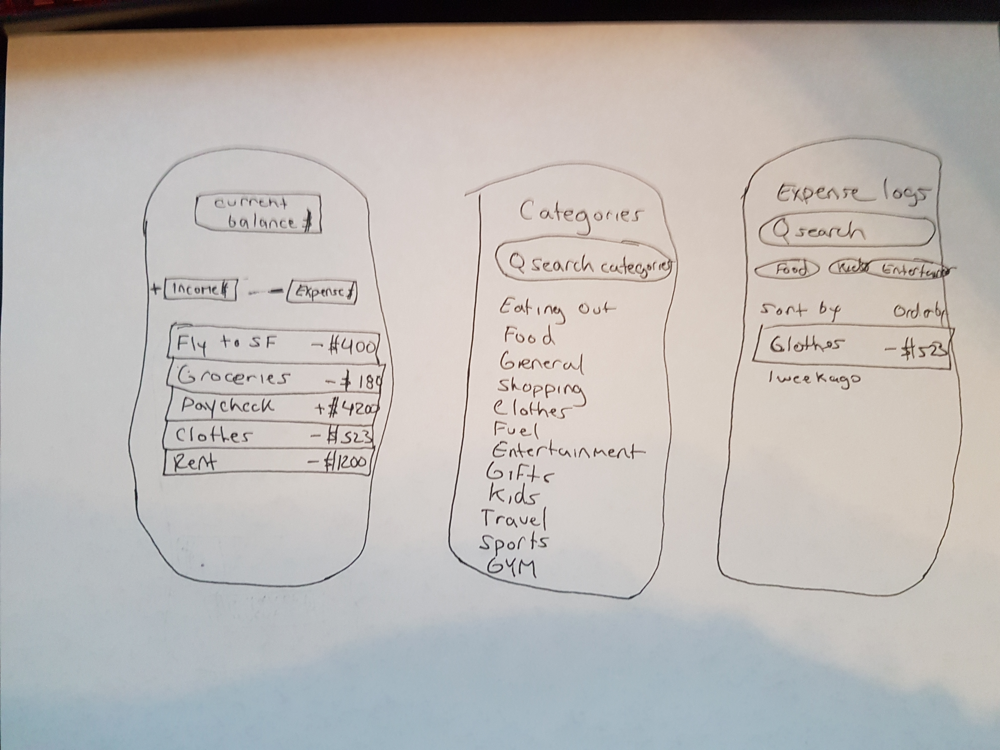

# Christopher Kappeler - SFSU CSC 690 Final Project

App Name:   ExpenseTracker

### Description
This Budgeting app called ExpenseTracker will help you keep track your income and expenses. You can use this app to mostly see how much money you're each month. If you want to be aware of your finances this is definitely a great app.

### Must Have Features
* Show Annual Salary
* Sort Transactions
* Enter Transaction
* Expense Categories

### Nice-to-have Features
* Weekly, Monthly, Yearly expenses
* Graphs and pies of expenses

## Wire frames

## Timeframe:
*  Annual Salary: 1 hours  
*  Sort Transaction: 12 hours  
*  Answer display: 12 hours  
*  Button to reveal an answer: 1/2 hour  
*  Button to continue in the same category: 1/2 hour  
*  Button to go back to the main menu: 1/2 hour  
*  Hints: 8-10 hours  

*  Difficulty level options: 4 hours
*  Score based system: 4 hours
*  Timed Questions: 4 hours
*  Multple Choice: 12+ hours
*  Difficulty level options: 4 hours   

### Total time 
* 48 hours
*
